# CS Hardware - Day 7

## Create

---

# Goal For Today

By the end of today you will:

- Explore how products begin as prototypes
- Build creative electronics projects
- Present your work

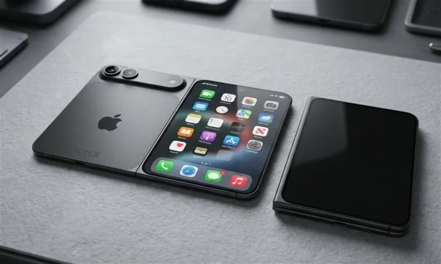

---

# Review Of Our Journey

Day 1: Measure
Day 2: Flow
Day 3: Time
Day 4: Wave
Day 5: Control
Day 6: Join

Today: **Create**

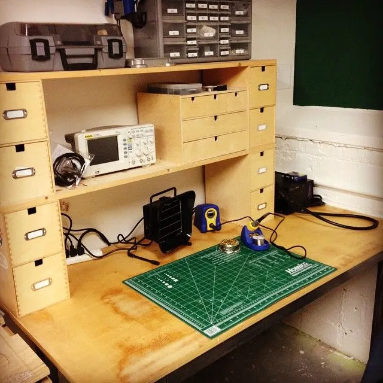

---

# Every Product Starts Somewhere

The products we use every day started as rough prototypes.

Often:

- ugly
- incomplete
- handmade
- experimental

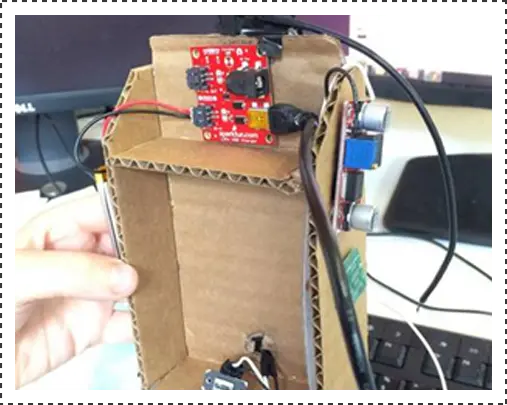

---

# The Apple I

One of Apple's first computers was hand assembled.

Built by:

- Steve Wozniak
- Steve Jobs

Started as a hobby project.

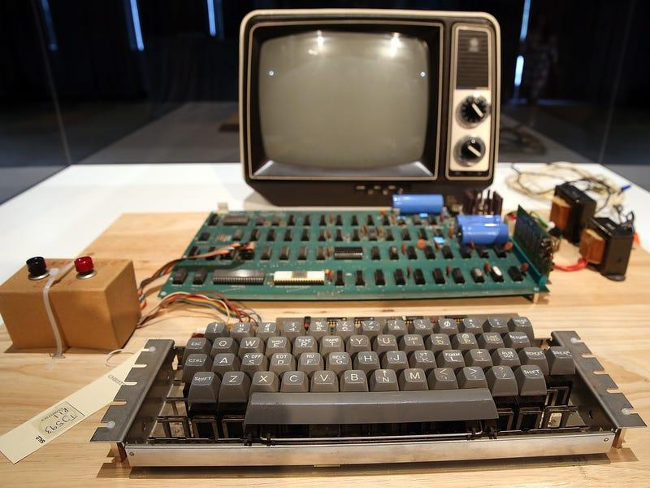
<!-- 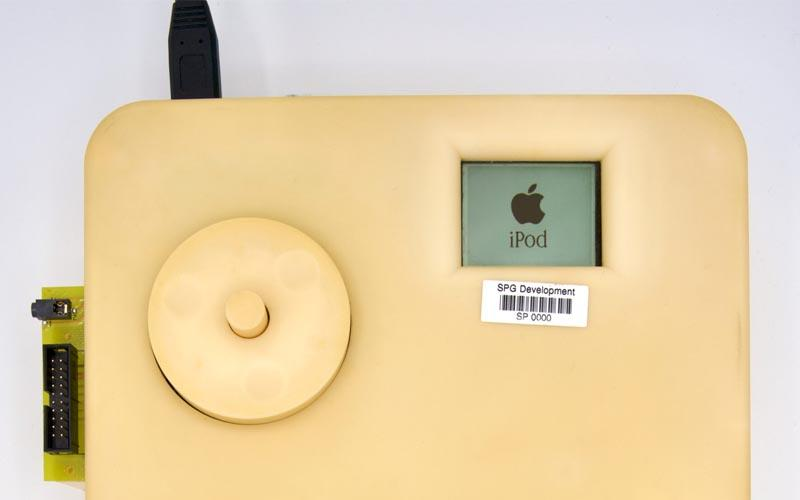 -->

---

# Early iPod Prototype

Engineers often hide prototypes inside larger boxes while testing ideas.

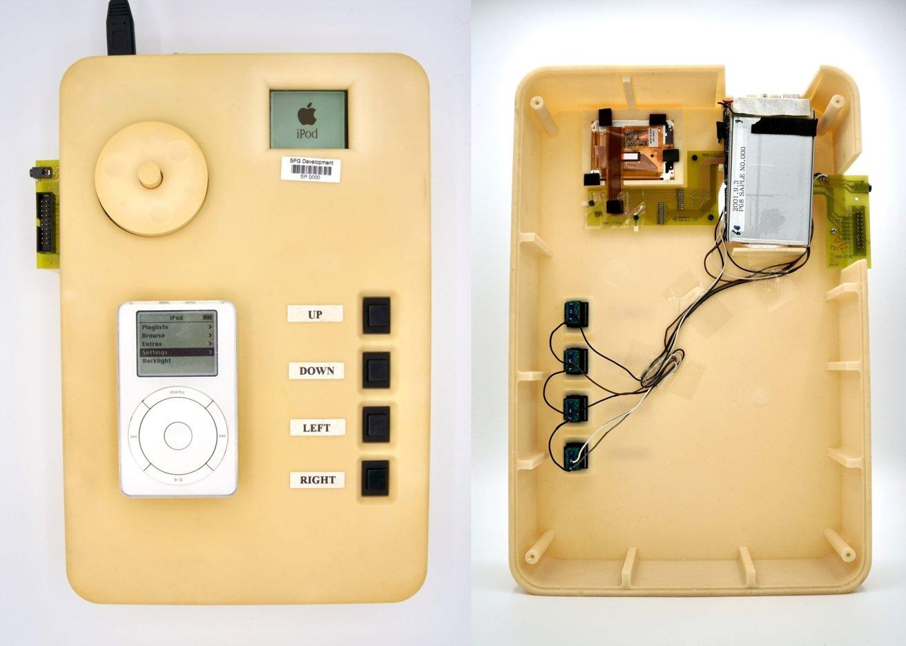

<!-- Instructor Notes:

The goal is learning, not appearance.

Many prototypes look strange.

-->

---

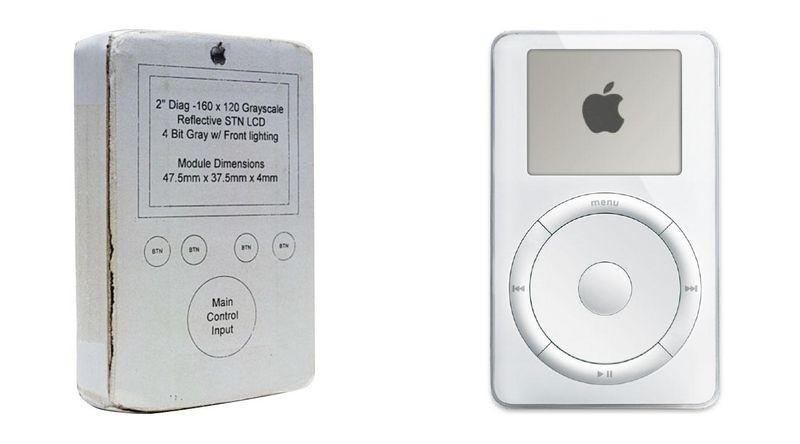

---

# Early iPhone Prototype

Before becoming a polished product, engineers tested:

- screens
- batteries
- software
- buttons
- radios

Separately.

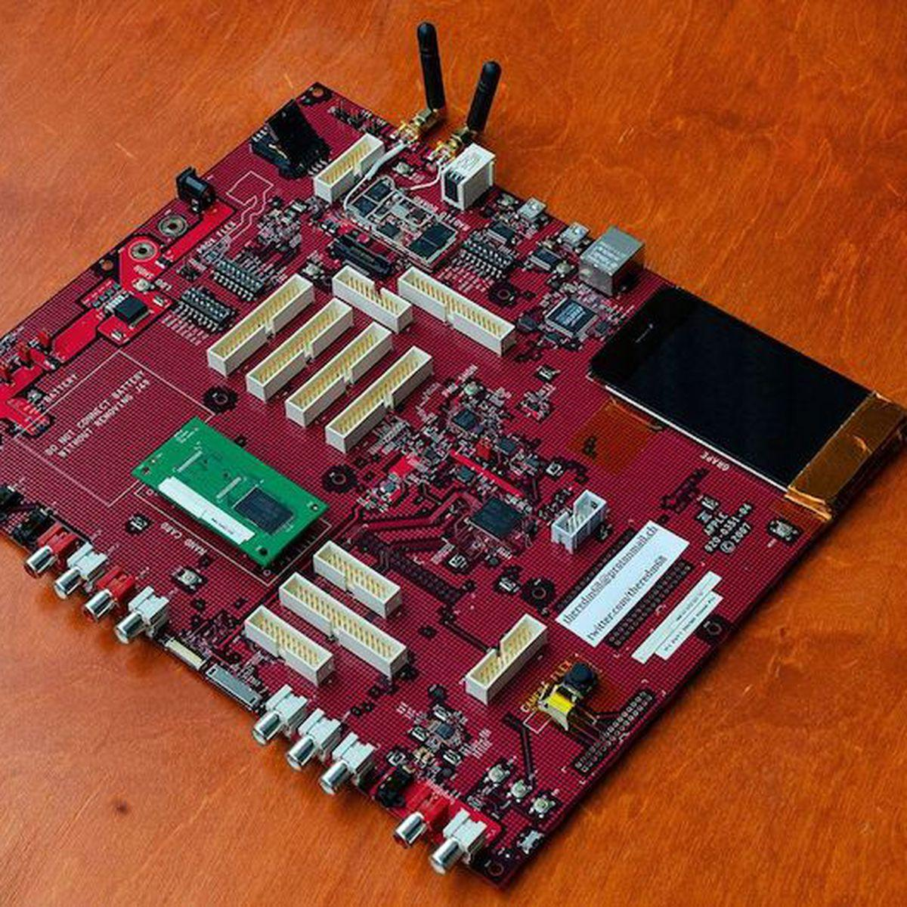

---

# Mouse Prototype

Before the computer mouse became a polished product, it looked like this.

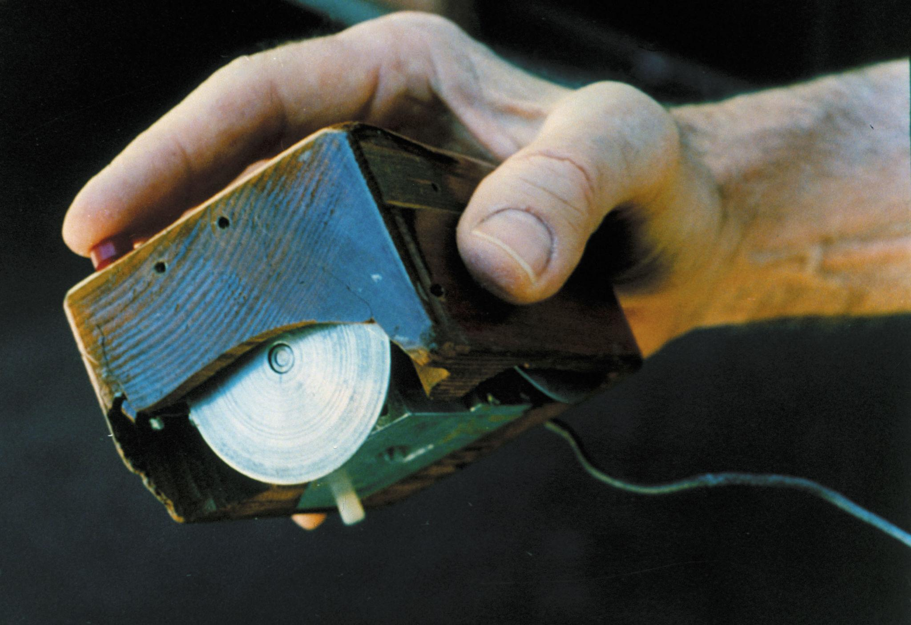

<!-- INSTRUCTOR NOTES

* Built by Douglas Engelbart's team in the 1960s
* Hand-made wooden enclosure
* Two wheels measured movement
* Nicknamed "the mouse" because of the cable

The goal wasn't to look good.

The goal was to answer a question:

> Can people interact with computers more naturally?

Almost every modern computer today uses descendants of this design.

Engineering often starts with rough prototypes that test a single idea.

-->

---

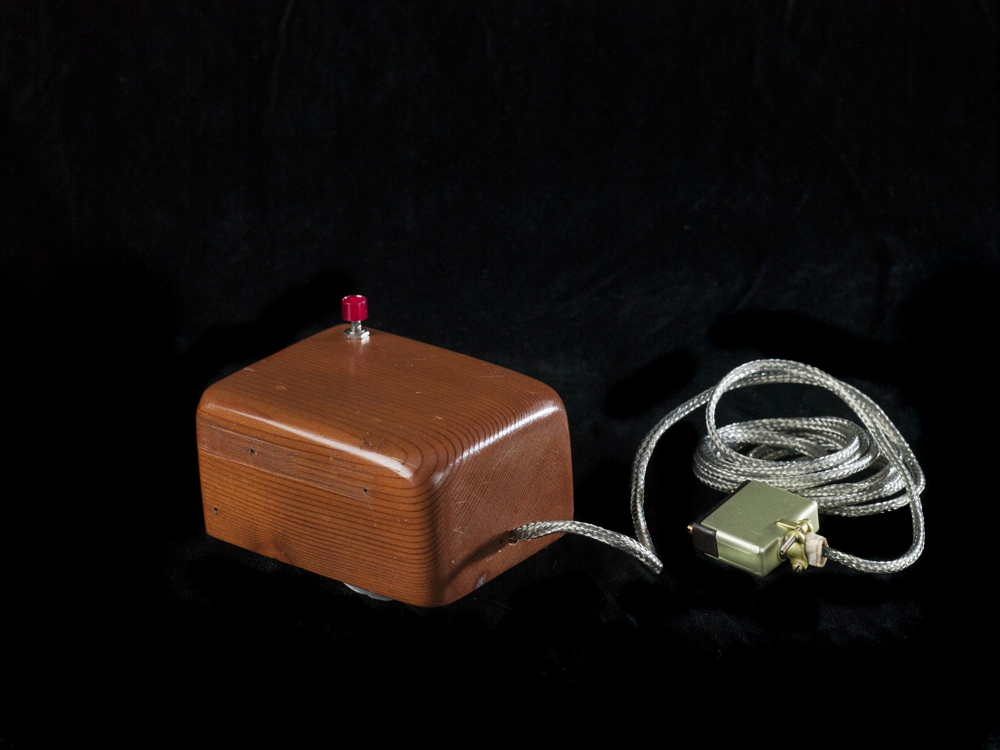

---

# The First Webcam

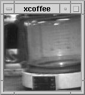

<!-- INSTRUCTOR NOTES

In 1991, researchers at Cambridge University had a problem:

The coffee pot was down the hall.

People kept walking over only to discover it was empty.

The solution: point a camera at the pot and display it on their computers

-->

---

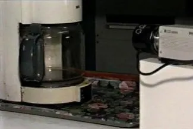

---

# Google Server

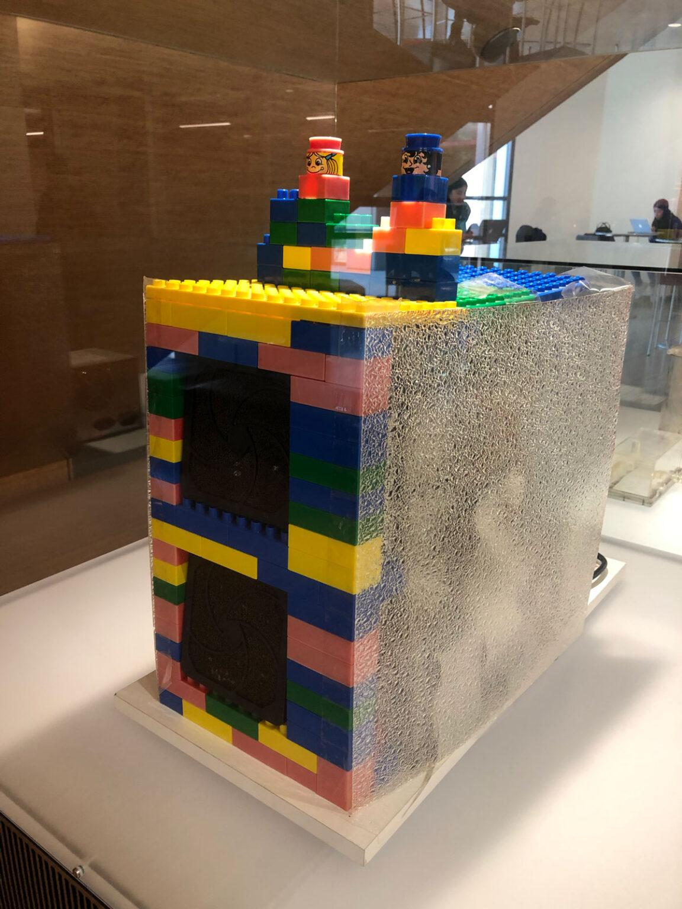

<!-- INSTRUCTOR NOTES

In the late 1990s, Google was growing quickly.

They needed more servers.

But servers were expensive.

Google engineers built server racks from:

- inexpensive PC components
- custom wiring
- LEGO bricks

The LEGO helped hold components in place.

-->
---

# Dynabook

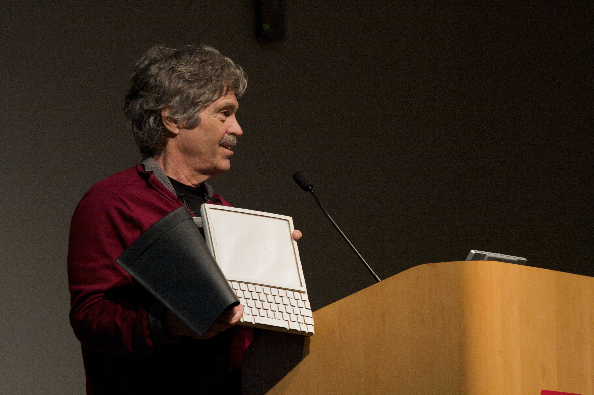

<!-- INSTRUCTOR NOTES

# Computers Were For Experts

In the late 1960s, computers were:

- expensive
- room-sized
- difficult to use
- operated by specialists

Most people never touched one.

Alan Kay Had A Different Idea

What if every child had a personal computer?

One that was:

- portable
- affordable
- interactive
- designed for learning

-->

---

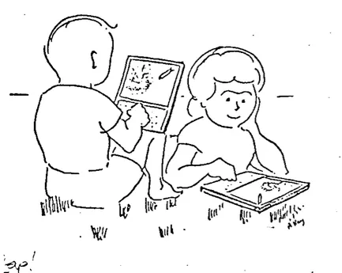

---

# Engineering Design Process

1. Identify a problem
2. Brainstorm ideas
3. Build a prototype
4. Test
5. Improve
6. Repeat

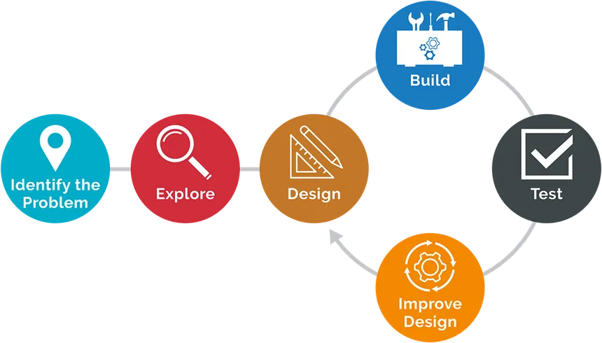

---

# Prototype Early

Don't wait for perfection.

Build something simple.

Learn from it.

Improve it.

<!-- 

---

# What Makes A Good Prototype?

A prototype should answer a question.

Examples:

- It would be cool if ...
- Is it useful?
- Is it reliable?
- Is it easy to use?

 

-->

---

# Craft + Electronics

Not all electronics projects look like circuit boards.

Electronics can be combined with:

- paper
- cardboard
- fabric
- art
- crafts

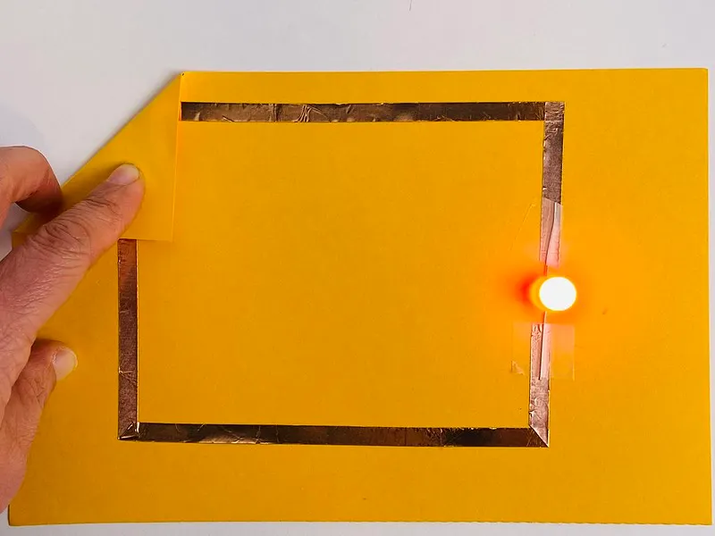

---

# Demo: LED Greeting Card

Create a paper circuit using:

- LED
- battery
- conductive tape

[Video](https://www.youtube.com/shorts/KtJXftvsYoY)

---

# Lab Breakout #1

## LED Greeting Card

Requirements:

- LED lights
- custom artwork
- working switch

---

<!-- TODO: enclosures / project box could come later

# Why Enclosures Matter

Most users never see the electronics.

They see:

- buttons
- displays
- cases
- labels

---

# From Prototype To Product

Electronics often begin like this:

---

# And End Like This

Packaged.

Protected.

Usable.

---

# Demo: Building A Project Box

We'll learn:

- layout
- mounting
- cable management
- labeling

---

# Lab Breakout #2

## Build A Project Box

Package a circuit into an enclosure.

Consider:

- usability
- durability
- appearance

--- 

-->

# Capstone Challenge

Use everything we've learned.

Build something original.

---

# Possible Projects

- traffic light
- reaction timer
- electronic game
- name badge
- alarm
- digital pet
- music maker
- sensor project
- or solve a problem for yourself!

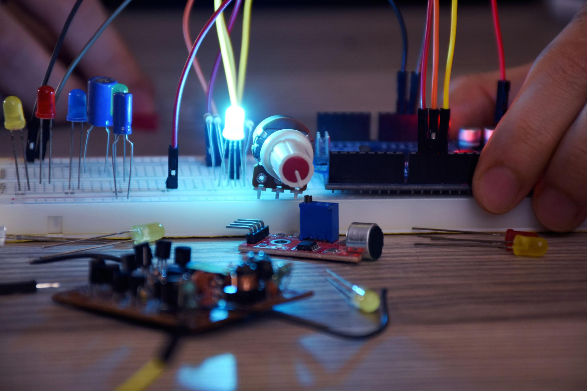

---

# Planning Sheet

Before building:

- What problem are you solving?
- What inputs are needed?
- What outputs are needed?
- What components are needed?

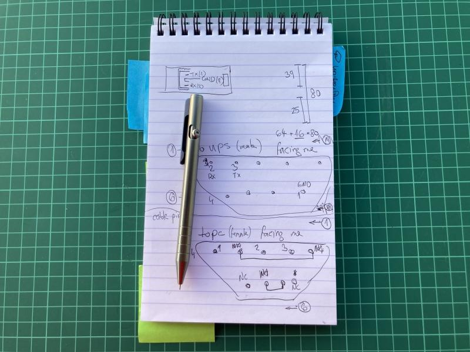

<!-- ---

# Build

Prototype first.

Test often.

Improve continuously.

---

# Debugging Is Engineering

Every engineer spends time:

- testing
- troubleshooting
- improving

Problems are expected.

-->

---

# Lab Breakout #2 - Project Showcase

Prepare a short presentation.

Share:

- What you built (or plan to build)
- How it works
- What you learned

<!--  -->

---

# Reflection

Think back to Day 1.

You started with Ohm's Law

Now you can build complete systems.

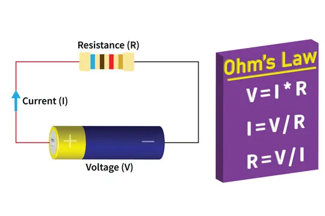

---

# The Journey

1 - Measure
2 - Flow
3 - Time
4 - Wave
5 - Control
6 - Join
7 - Create

---

# Key Takeaways

<!--

- Every product starts as a prototype
- Prototypes answer questions
- Iteration is normal
- Packaging matters
- Creativity and engineering work together
- You now have the skills to build your own projects

-->

---

# Show and Tell
